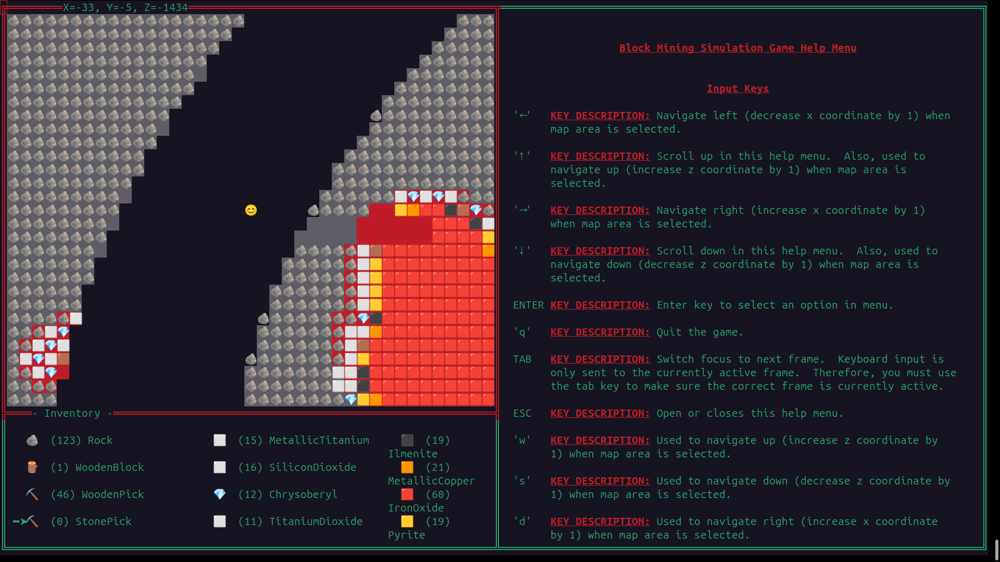

#  CONTRIBUTING

DO NOT CREATE PULL REQUESTS FOR THIS PROJECT.

ANY PULL REQUESTS YOU CREATE WILL NOT BE MERGED IN.

This project does not currently accept pull requests from the public.

Having said this, please do file issues if you notice something broken or undesirable.

#  Terminal Block Mining Simulation Game



This project contains the 'Terminal Block Mining Simulation Game', a video game where you simulate mining blocks of iron ore in the terminal.  The game uses procedural terrain generation and the game world itself is infinite.  The terrain will start generating automatically in the background near the player.  All generated terrain and player data is stored in a SQLite database file.  The location of this world file defaults to the directory where you launch the game, but you can configure it with the '--block-world-file' flag.  You can also use the '--log-file' to set the location of a log file.  If the '--log-file' flag is omitted, logging will be disabled.

#  Player Movement

You can use the 'w', 'a', 's' 'd' keys to move around on the screen.  You can use the space bar to go up and the 'x' key to move down (assuming there isn't a solid block in the way on a different level).

#  Exiting/Quitting The Game

Press the 'q' key to quit the game.

#  Mining Blocks

Press the 'm' key to mine blocks.

#  Crafting

You can press the 'c' key to try and craft new blocks, such as metallic iron, and an iron pickaxe.  Currently, the game only supports four different crafting recepies:

-  Using wood to make a Wooden Pick Axe
-  Using stone and wood to make a Stone Pick Axe
-  Using iron oxide and wood to make Metallic Iron
-  Using metallic iron and wood to make an Iron Pick Axe

#  Place Blocks

Press the 'p' key to place blocks (currently only supports placing rock blocks).

#  Help Menu


You can run the .jar file with the '--help' flag to show a help menu:

```
java -jar block-mining-simulation-game-single-player-client-0.0.5.jar --help
```


```
Block Mining Simulation Game - Available Command-line Arguments:

--help                                     - Display this help menu.
--debug-arguments                          - Echo back info about the value of command line argument values were parsed, and what the default values are.
--log-file                        <arg>    - The name of the log file to use.  If not provided, there will be no logging.
--disable-jni                              - Disable the use of JNI (may cause some events like to window size changes to be ignored).
--restricted-graphics                      - Use only the simplest ASCII characters to produce graphics.  Required when running on non-graphical display ttys.
--allow-unrecognized-block-types           - Allow the game to run even when there are block types that aren't supported in the block schema.
--block-world-file                <arg>    - The name of the sqlite database file (SQLITE only).
--print-block-schema                       - Print current block schema and exit.
--block-schema-file               <arg>    - If specified, ignore the default built-in block schema and uses the one provided at file/path.
--print-user-interaction-config            - Print the current configuration that describes which keys control the game.
--user-interaction-config-file    <arg>    - If specified, ignore the default built-in user interaction config and uses the one provided at file/path.
--database-subprotocol            <arg>    - The protocol for the database connection string.  Currently supports 'postgresql' and 'sqlite'.
--database-hostname               <arg>    - The 'hostname' for the database connection. Can be IP address or DNS name.
--database-port                   <arg>    - The port for the database connection.
--database-name                   <arg>    - The 'name' of the database to connect to for the database connection string.
--database-username               <arg>    - The username for the database connection.
--database-password               <arg>    - The password for the database connection.
```

#  Supported Platforms

Currently, the game has only been tested to work on a default installation of Ubuntu Linux.

#  Launching The Game

Compiling the game from scratch is not necessary.  You can download pre-compiled .jar files from GitHub in the 'Releases' section for this repo:

```
wget https://github.com/RobertElderSoftware/robert-elder-software-java-modules/releases/download/0.0.5/block-mining-simulation-game-single-player-client-0.0.5.jar
java -jar block-mining-simulation-game-single-player-client-0.0.5.jar
```

The game should immediately launch and fill up the terminal with graphics.  You can exit the game by pressing the 'q' key.  By default, the game saves it's world data into a SQLite database file that lives in the current directory.

#  Verify The Jar Signature (Optional)

If you are concerned about the authenticity of the .jar file, you can also verify the signature using GPG:

```
wget https://github.com/RobertElderSoftware/robert-elder-software-java-modules/releases/download/0.0.5/block-mining-simulation-game-single-player-client-0.0.5.jar.asc
gpg --search-keys robert@robertelder.org
#  Should match the key for 'robert@robertelder.org'
gpg --recv-keys ECBD481DBCA5C48804FBD08720B9852CF0558BAA
gpg --verify block-mining-simulation-game-single-player-client-0.0.5.jar.asc block-mining-simulation-game-single-player-client-0.0.5.jar
```

The output should look something like this:

```
gpg: Signature made Thu 01 Aug 2024 01:49:03 PM EDT
gpg:                using ECDSA key ECBD481DBCA5C48804FBD08720B9852CF0558BAA
gpg: Good signature from "Robert Elder (Created on 2024-07-31) <robert@robertelder.org>" [unknown]
gpg: WARNING: This key is not certified with a trusted signature!
gpg:          There is no indication that the signature belongs to the owner.
Primary key fingerprint: ECBD 481D BCA5 C488 04FB  D087 20B9 852C F055 8BAA
```

#  Building The Game

To build the game, you will need to set up a development environment that can support Java 17 and a version of maven that can support Java 17.

To build the JNI library, you will also need a c++ compiler and make

```
sudo apt-get install g++ make
```

Next, you can compile the game from source by running this command:

```
./res-modules/block-mining-simulation-game-single-player-client/run_single_player_client.sh
```

Once it finishes building, it should launch right into the game.

#  Alternative Key Mappings (Dvorak)

I received a couple requests to add support for reconfiguring the mapping of keyboard inputs, so I've added an option to specify a JSON config file where you can customize which input characters will trigger different actions in the game:

```
--user-interaction-config-file custom_key_config.json
```

For a Dvorak keyboard, I believe the following should work to give you the same experience that you'd get on a querty keyboard (although I can't say for sure as I don't have a Dvorak keyboard):

```
{
	"ACTION_Y_PLUS": ",",
	"ACTION_Y_MINUS": "o",
	"ACTION_X_PLUS": "e",
	"ACTION_X_MINUS": "a",
	"ACTION_Z_PLUS": " ",
	"ACTION_Z_MINUS": "q",
	"ACTION_MINING": "m",
	"ACTION_CRAFTING": "j",
	"ACTION_QUIT": "'",
	"ACTION_PLACE_BLOCK": "l"
}
```

You can see the default user interaction config file printed to standard out by running the jar with the following parameter:

```
--print-user-interaction-config
```

#  License

See LICENSE.md
